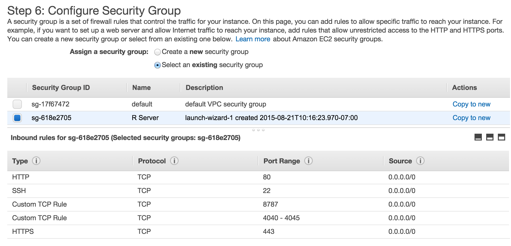

## Preliminaries

This tutorial explains in a minimal way how to start and use a spot instance on Amazon EC2. There are several good blog articles but I found they didn't cover some aspects in great detail. There are too many services and options provided by Amazon, which can be quite daunting at first.


Spot prices last month:

* r3-xlarge: 30GB RAM, 4 cores, $0.03-$0.07/hour

* r3-8xlarge: 244GB RAM, 32 cores, $0.25-0.50/hour

* m4.10xlarge: 160GB RAM, 40 cores, $0.30-0.50/hour

Spot instances are cheap because they are build on the concept of market-based pricing. That is, should you be outbid by someone else your instance will be killed by Amazon with only a minute warning. While this happens, its quite rare. A spot instance is ideal for large data benchmarking and simulations; i.e., tasks that can simply be restarted if your instance was killed.

Until your instance is terminated by Amazon, it belongs to you and only you. It's your own private server. That is, you have root access allowing you to install any software you want. You don't compete for the server's resources with other users. The only disadvantage is that you have to pay for it. Note that other compute clusters, such as, Savio, require you to share the CPUs between multiple users and installing/updating any system-wide software (such as R) can only be done by the system-administrator.

* **Note 1**: If you are trying to learn how to use the Savio cluster, I suggest looking at Jeremy Cole's tutorial: https://github.com/jeremyrcoyle/saviosnow

* **Note 2**: This tutorial is partly borrowed from Oleg Sofrigin's AWS tutorial at PH240B (Fall, 2015), https://github.com/Rdatatable/data.table/wiki/Amazon-EC2-for-beginners plus a couple of additional sources.

* **Note 3**: These instructions are for OS X. Everything is nearly identical for Windows, except that you will need to download an SSH client (`PuTTY` is one example and there are many others)

* **Note 4**: For OS X, you will typically use the build-in `Terminal` application for all your communications with the remote Amazon instance. As an alternative, I suggest trying out `iTerm 2` (https://www.iterm2.com/). It has a lot of additional features for customizing your workflow. It also simplifies the file transfer between your computer and the remote Amazon instance (more on that later).

## Installing Amazon command line tool (CLI) & generating ssh keys
1. Install AWS Command Line Interface (CLI) http://aws.amazon.com/cli/, by running this command from your terminal. This will allow you to fully automate your communication with the remote instance and makes it easy to remotely set-up R and R Studio Server.
```
pip install awscli
```

2. Generate a personal ssh key for future passwordless access to any amazon instance. If you haven’t yet created an ssh key for your local system, it can be done with the command in your terminal:
```
ssh-keygen
```
  This will create two files in your directory `~/.ssh/`: `id_rsa` and `id_rsa.pub`. The latter is your public key that you now need to upload to AWS.

3. Run the following CLI script to upload this just generated public key to all AWS regions:
```
keypair=$USER
publickeyfile=$HOME/.ssh/id_rsa.pub
regions=$(aws ec2 describe-regions --output text --query 'Regions[*].RegionName')
for region in $regions; do
  echo $region
  aws ec2 import-key-pair --region "$region" --key-name "$keypair" --public-key-material "file://$publickeyfile"
done
```
  **N.B.** You can also do this step manually, uploading the public key for each region from EC2 management console:


## Choosing and reserving the Amazon EC2 "instance"

1. Create an account (including your credit card details):  http://aws.amazon.com/ec2/

2. Get to the EC2 Management Console and bookmark it in your browser.

3. Click Spot Requests in the left hand menu. Your screen should now look like this :


4. Resist temptation to click the blue "Request Spot Instances" button, but click the Pricing History gray button at the top instead.

5. Change instance type in the drop down at the top to the one you want; e.g. `m4.10xlarge`. You have to use another source to know how much RAM and how many cores each instance name corresponds to; e.g. http://www.ec2instances.info/. Observe history and current price. If this isn't acceptable, close price history and change the region in the drop down box in the black area at the top right of the Management Console. Then click price history again. Keep changing regions/type until you find a region/type where the price is acceptable. Each region/type combination is priced separately.

6. Now click the blue "Request Spot Instances" button.  Note that this isn't the same as the "Launch instance" button in the Instances view (although that is where we'll view the spot instance in a moment).

  Step 1: (Choose an Amazon Machine Image) The Quick Start machine images are selected by default. Choose the Ubuntu one. Currently it's the 4th one down: Ubuntu Server 14.04 LTS (HVM), SSD Volume Type, 64bit. This is a brand new, blank and factory fresh Linux server. Simple. No dependencies. No software or libraries pre-installed that might be out of date.

  Step 2: (Choose an Instance Type) For example, choose r3-8xlarge (244GB RAM and 32 cores).

  Step 3: (Configure Instance Details) The maximum bid price is the only one to complete. This is the maximum you're prepared to pay per hour. Start with the current spot price from point 5 above and with knowledge of the history add some margin; e.g., if the spot price is $0.25 then I tend to bid $0.50.  If you are outbid, you will have no opportunity to increase your bid ... your instance will just be killed.

  Step 4: (Add Storage) Next

  Step 5: (Tag Instance) Next

  Step 6: (Configure Security Group)  SSH (port 22) is already open by default.  It's important to add HTTP (80) and HTTPS (443) otherwise R can't download packages. You will also need to open ports for Rstudio Server, by adding `Custom TCP Rule:TCP:8787` and `Custom TCP Rule:TCP:4040 - 4045`. In the security group name field, change "launch-wizard-1" to "R Server", then next time you can just choose "Existing security group" instead. Here is the summary of ports that you need to configure:
  

7. Click Review and launch

8. Click Launch

9. (Select an existing key pair or create a new key pair)  Select "Choose an existing key pair" and select the key name you just uploaded (your Mac OS X user name).

10. Check the tick box and click "Request Spot Instance" blue button.

  Your request will now appear as a new line in the "Spot Requests" view. After at most a minute the status will change from yellow to a green state "active" and status "fulfilled". However, the view does not refresh automatically so you need to click the refresh button in the top right every 10 seconds or so. You can now change to the "Instances" view (INSTANCES=>Instances on the left menu) and you have a new line there as well. Your instance is now running and you are being charged per hour whether it is idle or not. Ensure you don't forget to kill any running instances when you're finished otherwise you'll get a surprise when the monthly bill arrives in your inbox. There are no time limits or warnings about running instances you may have forgotten to terminate.

9. Select the instance (if not already selected) by ensuring the blue check box is filled in so that the gray Connect button at the top is active and click it. This doesn't really connect, it just displays a window showing you how to connect.

10. Copy the IP address from this example line:

```
ssh -i "wilson.pem" ubuntu@52.9.46.244
```
  NB: The .pem filename and the IP address will be different for you.

11. To ssh into your new server paste the IP address with the following:
```
ssh ubuntu@52.9.46.244
```
  Enter "yes" to "Are you sure you want to continue connecting (yes/no)?"

12. You now have a prompt to a factory fresh large-memory machine. Type `free -h` - this is how much RAM you got. Type `lscpu` - these are the CPUs you can use. You can transfer files to and from the server (the old fashioned way, we later will discuss an interactive tool for doing the same):

```
# To copy to EC2 (final colon needed):
scp localFile.csv ubuntu@54.183.161.72:

# To copy from EC2 (final space then dot is needed):
scp ubuntu@54.183.161.72:~/remoteFile.csv .
```

## Setting up the Ubuntu server

1. Save the following script in a file ./_setup1_ubuntu.sh (already attached), then run `chmod +x ./_setup1_ubuntu.sh` to make it executable. This will be called later on to install `R`, `R Studio Server` and a bunch of other useful utilities.
```
#!/bin/bash
echo "running set-up script."
# --------------------------------------------------------------------------
# add ubuntu to staff user to be able to install R packages to default location:
# --------------------------------------------------------------------------
sudo adduser ubuntu staff
# --------------------------------------------------------------------------
# install a bunch of ubuntu software
# --------------------------------------------------------------------------
sudo apt-key adv --keyserver keyserver.ubuntu.com --recv-keys E084DAB9
sudo add-apt-repository 'deb  http://cran.stat.ucla.edu/bin/linux/ubuntu trusty/'
sudo apt-get update
sudo apt-get -y install r-base-core             # R
sudo apt-get -y install lrzsz                   # a tool for remote file transfer:
sudo apt-get -y install libcurl4-openssl-dev    # for RCurl which devtools depends on
sudo apt-get -y install libxml2-dev             # needed for devtools
sudo apt-get -y install htop                    # to monitor RAM and CPU
sudo apt-get install gdebi-core -y              # compiler for installing Rstudio Server
wget https://download2.rstudio.org/rstudio-server-0.99.489-amd64.deb # Rstudio Server
sudo gdebi rstudio-server-0.99.489-amd64.deb -n
# --------------------------------------------------------------------------
# create a user "rstudio" w/ password "rstudio"
# --------------------------------------------------------------------------
sudo adduser rstudio <<EOF
rstudio
rstudio
EOF
sudo adduser rstudio staff # add rstudio user to staff group (to install future R packages in the same location)
```

2. Similarly, save the following R script in a file `./_setup2_R.R` (already attached), then run `chmod +x ./_setup1_ubuntu.sh` to make it executable. This will be used later to remotely install your favorite R packages:
```
#!/usr/bin/Rscript --vanilla
options(repos = "http://cran.cnr.berkeley.edu/")
install.packages("doParallel")
install.packages("ggplot2")
install.packages("itertools")
install.packages("devtools")
install.packages("data.table")
install.packages("igraph")
require(devtools)
install.packages("pryr")
# to install an R package from github:
# devtools::install_github('wilsoncai/test', build_vignettes = FALSE)
```

3. Next run the following script (from your Mac OS terminal, NOTE FROM THE REMOTE ubuntu server), to automatically install all of the above, set up your R Studio Server with account `rstudio` and password `rstudio` and install all of these R packages. Note this script is attached as '0_run_remote_setup.sh' and this is the only thing you will need to run:
```
./0_run_remote_setup.sh
```


The script for `0_run_remote_setup.sh`:
```
#!/bin/bash
aws ec2 describe-instances --query 'Reservations[*].Instances[*].[Placement.AvailabilityZone, State.Name, InstanceType, InstanceId, PublicIpAddress]' --output table
# this will work only if there is one actively running instance:
host=$(aws ec2 describe-instances --query 'Reservations[*].Instances[?State.Name==`running`][PublicIpAddress]' --output text)
echo $host
# --------------------------------------------------------------------------
# *) copy install script files:
# --------------------------------------------------------------------------
scp -o StrictHostKeyChecking=no _setup1_ubuntu.sh ubuntu@$host:
# --------------------------------------------------------------------------
# *) remotely install ubuntu software (including R & R studio server)
# --------------------------------------------------------------------------
ssh ubuntu@$host 'sudo /home/ubuntu/_setup1_ubuntu.sh'
# --------------------------------------------------------------------------
# *) remotely install R packages
# --------------------------------------------------------------------------
ssh ubuntu@$host 'sudo /home/ubuntu/_setup2_R.R'
# --------------------------------------------------------------------------
# *) to directly ssh into remote server:
# --------------------------------------------------------------------------
ssh ubuntu@$host
```

4. Now open Rsudio Server window with script `./1_open_Rstudio.sh` (provided below):
```
  ./1_open_Rstudio.sh
```

Type
```
login: rstudio
password: rstudio
```

You now have an interactive Rstudio environment on your remote server.

The script for `1_open_Rstudio.sh`:
```
#!/bin/bash
host=$(aws ec2 describe-instances --output text --query 'Reservations[0].Instances[*].PublicIpAddress')
/Applications/Google\ Chrome.app/Contents/MacOS/Google\ Chrome --new-window $host:8787

```

5. Also save the following script under `./sshec2.sh`, so that you can ssh into your remote Ubuntu server by simply typing:
```
./sshec2.sh
```

The script for `sshec2.sh`:
```
#!/bin/bash
aws ec2 describe-instances --query 'Reservations[*].Instances[*].[Placement.AvailabilityZone, State.Name, InstanceType, InstanceId, PublicIpAddress]' --output table
host=$(aws ec2 describe-instances --query 'Reservations[*].Instances[?State.Name==`running`][PublicIpAddress]' --output text)
echo $host
ssh ubuntu@$host
```

Once you're used to it, you can get to this point in under 5 minutes. Now I can copy any file onto my remote server by just using OS X drop down menus (its magic!). To copy files into Ubuntu, type `rz`, select the file you want. It works the same way with sending files, by using `sz` command.
**N.B.** For this to work you need to first configure `iTerm`, following the instructions here https://github.com/mmastrac/iterm2-zmodem More information can be also found here: https://www.iterm2.com/documentation-triggers.html


## Workflow

1. Start another shell, run attached script `./sshec2.sh` to connect to remote host and type `htop`. Leave this running to monitor RAM and CPU usage on the remote instance.

2. Type `df -h` and observe disk size is not large. However you have 244GB of RAM. Use ram risk by writing and reading to `/dev/shm`, plus that'll be very fast disk access. Even if you use 100GB of ram disk, you'll still have 140GB of RAM. Any results you want to keep, transfer them from the server to your local machine.

## Parallel computing with R

The easiest way to perform parallel computing with R is by using the packages `foreach` and `doParallel`. From your Rstudio broswer window, run:

```
R
library(foreach)
library(doParallel)
detectCores()
```

Function `detectCores()` can be used to tell you how many cores (CPUs) are available on your server. We first "register" these cores, by running `registerDoParallel`:

```
(ncores <- detectCores())
registerDoParallel(cores = ncores)
```

  We can now turn any loop/lapply call in R into its parallized version, by using `foreach` and `%dopar%` constructs. A simple working example below just returns the process ID of each child processes.

```
xpid <- function(x) c(x=x, pid=Sys.getpid())

res <- foreach(i=1:100, .combine = 'rbind') %dopar% xpid(i)
```

  N.B. `.combine` above is a handy way to tell `foreach` function how to combine the results of different parallel runs.

  For a slightly more involved example of parallel computing in R, see `foreachpar_example.R`.

## Terminate your spot instance

18. **Don't forget to terminate your instance**

  When you're finished, ensure to terminate your spot instance in the correct way using the Management Console. Use the Instances view (the same view you clicked the Connect button), select the instance, click Actions gray button at the top, select Instant state submenu and then Terminate.